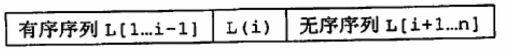
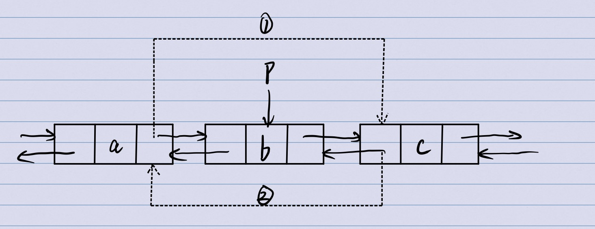

### **数据结构具体有哪几种？**
* 线性结构：线性表、栈、队列、字符串；
* 非线性结构：二叉树、森林、图；

### **数组和链表的区别**
* 从最底层的存储结构上来看，数组的存储结构是一块连续的内存空间，链表则是一组零散的内存块串联在一起；
* 根据底层存储结构可以知道，数组的插入和删除操作的时间复杂度是O(n)，随机访问的时间复杂度是O(1)；而链表的插入和删除操作时间复杂度是O(1),随机访问的时间复杂度是O(n);
* 同样的数据存储量，链表对存储空间的消耗更大，因为链表中的每一个节点都需要消耗额外的存储空间去存储下一个节点的指针；
* 在实际应用中，对链表进行频繁的插入、删除操作，会导致频繁的内存申请和释放，从而产生内存碎片；

### **面向对象中的封装、多态和继承。**
* 封装：指的是信息隐藏，把对象的属性和操作封装在一起，只留有对外接口，形成一个独立的单位，并尽可能隐藏其内部细节。
* 继承：是指子类可以自动拥有父类地全部属性和操作，并且还可以定义自己特有地属性和操作；
多态：主要指一个实体在不同的上下文条件下具有不同意义与用法的能力。变量所指向的可以实例化的类，只有在程序运行的时候才能够最终确定变量发起的方法，由用户选择究竟调用哪一个类来完成这个实例化。

### **描述学过的排序算法？**
* 插入排序：直接插入排序，折半插入排序，希尔插入排序；
    + 插入排序算法的核心思想是取未排序区间中的元素，在已排序区间中找到合适的插入位置，将其插入，并保证已排序区间数据一直有序。不断重复上述过程
    + 直接插入排序：
        - 
        - 查找出L(i)在L[1...i-1]中插入的位置k；
        - 将L[k...i-1]中所有元素依次向后移一个位置；
        - 将L[i]复制到L[k];
        - ```C
          void InsertSort(ElemType A[], int n){
              int i,j;
              for(i=2;i<=n;i++){
                  if(A[i]<A[i-1]){
                        A[0] = A[i];
                        for(j=i-1;A[0]<A[j];--j)
                            A[j+1] = A[j];
                        A[j+1] = A[0];
                  }
              }
          }
          ```
    + 折半插入排序是对直接插入排序的优化，在确认插入位置这个过程中，直接插入排序算法是采用遍历法，但是折半插入排序算法，在这里利用二分查找的策略，能够有效减少比较元素的次数；
        - 折半插入排序的时间复杂度仍然是O(${n}^{2}$)，但是对于数据量不大的排序表，能够表现出更好的性能；
    + 希尔排序的基本思想是：先将待排序表分割成若干形如L[i,i+d,i+2d,...,i+kd]的“特殊”子表，即把相隔某个“增量”的记录组成一个子表，对各个子表分别进行直接插入排序，当整个表中的元素已呈“基本有序”时，再对全体记录进行一次直接插入排序；希尔排序的时间复杂度约为O(${n}^{1.3}$)，最坏的情况是O(${n}^{2}$)
    + 插入排序是原地排序算法，空间复杂度是O(1)，时间复杂度是O(${n}^{2}$);
    + tips：虽然插入排序和冒泡排序时间复杂度一样，都是O(${n}^{2}$)，但是实际上插入排序的效率更高，因为冒泡排序在代码实现上比插入排序更加复杂，插入排序在元素交换过程中只需要一次赋值操作，而冒泡排序需要三次赋值操作；
* 交换排序：冒泡排序，快速排序；
    + 快速排序算法：
        - 快速排序算法主要利用分治思想，在待排序表L[1...n]中任取一个元素pivot作为基准，通过一趟排序将待排序表划为独立的两部分L[1...k-1]和L[k+1...n]，使得L[1...k-1]中的所有元素小于pivot，L[k+1...n]中的所有元素大于等于pivot，则pivot放在了其最终位置L[k]上，这个过程称为**一趟快速排序**，然后分别递归地对两个子表重复上述过程，直至每部分内只有一个元素或空为止，即所有元素放在了其最终位置上。
        - 快速排序算法的划分操作：核心思想是选取pivot（选取pivot之后，值虽然还在，但是这里相当于空出来位置了，可以用于保存需要交换的数据），把小于pivot的放在左边，大于pivot的放在右边，设置两个指针，low和high分别指向序列的最左边和最右边，从最右的high开始，如果大于就把指针前移，如果小于就把high指向的数据赋值到pivot的位置。对于low同理，如果小于就后移指针，如果大于就把指针指向的数据赋值到刚刚high空出来的位置；
        - ```C 
            int Partition(int A[],int low,int high){
                int pivot=A[low];     //一般选取当前表中第一个元素设为基准，对表进行划分
                while(low<high){      //循环跳出条件
                    while(low<high&&A[high]>=pivot) --high;
                    A[low]=A[high];   //将比基准值小的元素移动到左端
                    while(low<high&&A[low]<=pivot) low++;
                    A[high]=A[low];   //将比基准值大的元素移动到右端
                }
                A[low]=pivot;         //放回基准值元素
                return low;           //返回存放基准值的最终位置
            } 
            
            void QuickSort(int A[],int low,int high){
                if(low<high){
                    int pivotpos = Partition(A,low,high);
                    QuickSort(A,low,pivotpos-1);
                    QUickSort(A,povotpos+1,high);
                }
            }
        - 快速排序算法的空间复杂度是O(${log}_2n$)，时间复杂度是O(${nlog}_2n$)，快速排序是所有内部排序算法中平均性能最优的排序算法。
* 选择排序：简单选择排序，堆排序；
    + 简单选择排序：
        - 假设排序表为L[1...n]，第i趟排序即从L[i...n]中选择关键字最小的元素与L[i]交换，每一趟排序可以确定一个元素的最终位置，这样经过n-1趟排序就可使得整个排序表有序。
        - ```C
            void SelectSort(ElemType A[],int n){
                for(i=0;i<n-1;i++){                  //一共进行n-1趟
                    min = i;                         //记录最小元素位置
                    for(j=i+1;j<n;j++)
                        if(A[j]<A[min])
                            min = j;
                    if(min!=i)
                        swap(A[i],A[min]);
              }
          }
          ```
    + 堆排序：
        - 首先将存放在L[1...n]中的n个元素建成初始堆，由于堆本身的特点，堆顶元素就是最大值。输出堆顶元素后，通常将堆底元素送入堆顶，此时根结点已不满足大堆顶的性质，堆被破坏，将堆顶元素向下调整使其继续保持大顶堆的性质，再输出堆顶元素。以此往复，直到堆中仅剩下一个元素为止。
        - 堆排序的时间复杂度是O(${nlog}_2n$)
    + 选择排序的时间复杂度是O(${n}^{2}$)，空间复杂度是O(1);
* 归并排序：
    + 二路归并排序基本思想：假定待排序表含有n个记录，则可将其视为n个有序的子表，每个子表的长度为1，然后两两归并，得到[n/2]个长度为2或1的有序表：继续两两归并……以此往复，直到合成一个长度为n的有序表为止，这种排序方法称为2路归并排序；
    + 归并排序算法使用了分治思想，将大问题分解成小的子问题来解决。小的子问题解决了，大问题也就迎刃而解了。
    + ```C
        /*王道上归并算法的Merge函数，不是很赞同A[k]=B[i++]这种写法，纯粹为了简洁性，把代码的规范和可读性丢了*/
        void Merge(ElemType A[],int low,int mid,int high){
        //将表A的两段A[low...mid]和A[mid+1...high]各自有序，将它们合并成一个有序表
            for(int k=low; k<=low;k++)
                B[k]=A[k];
            //复制A中所有的元素到B
            for(i=low,j=mid+1,k=i;i<=mid&&j<=high;k++){
                if(B[i]<=B[j])                 //比较B的左右两段中的元素
                    A[k]=B[i++];               //将较小的值复制到A中
                else A[k]=B[j++];
            }
            while(i<=mid) A[k++]=B[i++];       //若第一个表未检测完，复制
            while(j<=high) A[k++]=B[j++];      //若第二个表未检测完，复制
            //两个while循环实际上只会进入一个
        }

        void MergeSort(ElemType A[],int low,int high){
        //2路归并算法
            if(low<high){
                int mid=(low+high)/2;
                MergeSort(A,low,mid);
                MergeSort(A,mid+1,high);
                Merge(A,low,mid,high);
            }
        }
        ```
    + 归并排序的空间复杂度O(n)，时间复杂度是O(${nlog}_2n$)，同时也是一种稳定的排序算法；
* 基数排序

### **快速排序和冒泡排序的原理，其空间复杂度是多少？**
* 快速排序：选择基准（一般选取第一个），根据基准将序列分成两半，对两半进行递归，重复前边的操作。空间复杂度：平均情况O(logn)
* 冒泡排序：从后往前两两比较相邻元素值，若为逆序，则交换，一趟排序后最小的会放第一个位置。或从前往后凉凉比较元素值，逆序就交换，一趟排序后最大的会放到最后。空间复杂度：O(1)

### **数据结构中的链表的逆置？**
* 头插法：初始化一个指针s，指向链表的头节点，然后用循环遍历链表，每次把s指向的节点插入到链表的最前端；

### **弗洛伊德算法？迪杰斯特拉算法？**
* 弗洛伊德：求任意两点之间的最短路径；
* 迪杰斯特拉：单元最短路径；

### **一个链表里面有循环，怎么确定循环的头尾相交节点？（如何确定链表有环？）**
* 遍历法：两层循环，每到一个结点，就从头开始在遍历到当前结点的前一个，看有无与这个结点相同的；
* 快慢指针法：两个指针，一个每次走一步，一个每次走两步，若两者相遇，则有环；
* Hash表法：每遍历一个结点，就把这个结点的id与哈希表中的比较，若没有，则存入，反之，则有环

### **双向链表删除当前节点**
* 
```
p->prior->next = p->next;
p->next->prior = p->prior;
```

### **一个链表里面有循环，怎么确定循环的头尾相交节点？**
* 如果允许修改节点的数据结构的话，那么就在每个节点上设置一个标志位表示是否被访问过。这样遍历时遇到已访问节点即是循环的第一个点；
* 如果不允许修改节点，那么就在外部用一个hashmap记录下所有的已访问的节点。遍历时先查找这个hashmap，如果节点不存在，就把该节点加入hashmap，如果存在，说明该节点就是循环的第一个节点；

### **函数为什么使用栈**
* 函数调用之所以使用栈，是因为函数中经常会使用嵌套，也就是相互之间的调用关系，这需要用到动态存储区的栈结构；
* 例如：A调用B，B又调用C，那么需要C先执行，然后结果赋值给B中的临时变量，B的执行结果再赋值给A的临时变量，嵌套越深的函数越需要被先执行，这样的特征刚好符合栈的特点，因此每次遇到函数调用，只需要压栈，最后依次从栈顶弹出，依次执行即可。
* tips：栈的本质上是受限的线性表，具有后进先出，先进后出的特性；栈的一些运用场景，浏览器的前进后退功能、编译器利用栈来实现表达式求值、括号匹配；

### **队列和链表相比缺点**
* 优点：空间使用少一个头结点空间；
* 缺点：对于顺序队列，空队列或者一个结点时插入和删除操作略复杂；

### **如何实现循环队列，优点是什么？**
* 将存储队列元素的表从逻辑上看成一个环，称为循环队列。同时需要牺牲一个单元来区分队空和队满。
* 优点事循环队列不会出现溢出的情况

### **解释一下什么是二叉树？如何遍历？**


### **递归算法的优缺点**
### **递归求斐波那契数列的复杂度？如何把复杂度降低为O(n)？**
### **调用函数的实现过程？**

### **快速排序和冒泡排序的原理，时间复杂度和空间复杂度是多少？**
* 冒泡排序算法：
    + 从后往前（或从前往后）两两比较相邻元素的值，若为逆序（即A[i-1]>A[i]），则交换它们，直到序列比较完；
    + 依次重复上述过程，直至遍历过后没有任何一对元素发生交换；
    ```C
    void BubbleSort(ElemTyppe A[], int n){
        for(i=0;i<n-1;i++>){
            flag = false;           //标注本趟冒泡是否发生交换的标志
            for(j=n-1;j>i;j--){     //一趟冒泡过程
                if(A[j-1]>A[j]){    //若为逆序
                    swap(A[j-1],A[j]); //交换顺序
                    flag = ture;
                }
                if(flag = false)
                    return;         //若一趟遍历过后没有发生交换，说明表已经有序；
            }
        }
    }
    ```
    + 冒泡排序的时间复杂度是O($\mathrm{n}^\mathrm{2}$)，空间复杂度是O(1)；
    + tips：冒泡排序算法是一种稳定的排序算法；
* 快速排序算法：
    + 
    + 