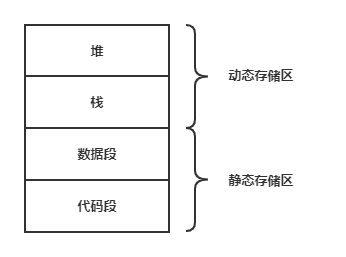

### **为什么要有系统调用？**
系统调用是操作系统为编程人员提供的接口，用户通过系统调用在程序中请求操作系统为其提供服务；用户可以通过陷入指令请求操作系统提供服务；其目的是为了使应用程序能够通过系统调用间接调用OS中的相关进程，进而获取相应的服务，这样能够有效避免应用程序直接执行对操作系统存在潜在危害的操作，从而保证操作系统的稳定性和安全性。

### **进程与线程的区别？**
* 进程是操作系统资源分配的最小单位，线程是操作系统调度执行的最小单位；
* 一个线程只可以属于一个进程，但是一个进程中能包含多个线程；
* 进程的创建和撤销的开销大于线程的创建和撤销；
* 线程无地址空间，其地址空间包含在进程的地址空间中；
* 进程通信需要进程同步和互斥手段的辅助，而线程可以通过直接读/写进程的数据段内容来通信；

### **操作系统的目录（分别学了哪些东西），什么是进程，进程调度是调度谁，进程的工作状态。**
* 目录：
    + 第一章节主要阐述操作系统的发展和种类，以及操作系统的体系结构（大内核和微内核）；从后开始阐述设计操作系统的具体设计细节;
    + 第二章节主要介绍操作系统中的进程管理，比如进程和线程概念的引入，处理机调度，死锁发生的原因，以及其预防和解除方法等，最后还有进程间通信涉及到的同步和互斥问题。
    + 第三章节主要介绍操作系统中的内存管理，主要涉及的就是内存的连续分配方式和非连续分配方式。其中非连续分配方式又分为分页和分段两种分配方式。以及阐述了操作系统在无法把程序一次性调入的内存的解决方法，即利用程序局部性原理，引入了虚拟存储技术，为了支持虚拟内存技术，操作系统所引入的请求调页功能和页面置换算法。
    + 第四章节主要介绍操作系统中的文件管理，主要阐述操作系统中文件系统是如何实现的，具体涉及到文件分配方式和文件存储空间的管理，以及不同操作系统中的文件共享机制，最后是磁盘的调度和管理；
    + 第五章节主要介绍操作系统中的输入/输出管理，阐述操作系统对于不同I/O设备的管理模式，主要涉及数据传送方式；因为操作系统可能往往面向不同的I/O硬件，因此引入了I/O子系统，用于保证I/O系统的可移植性和适应性；最后讲了I/O缓冲区和SPOOLing技术；
* 为什么要引入进程？
在多道程序环境下，允许多个程序并发执行，此时它们将失去封闭性，并具有间断性及不可再现的特性。为此引入了进程的概念，以便更好地描述和控制程序的并发执行，实现操作系统的并发性和共享性。
* 什么是进程？
进程是程序的一次执行过程；进程是一个程序及其数据在处理机上顺序执行时所发生的活动；进程是具有独立功能的程序在一个数据集合上运行的过程，它是系统进行资源分配和调度的一个独立单位。
* 什么是进程调度？
进程调度又称低级调度，其主要任务是按照某种方法和策略从就绪队列中选取一个进程，将处理机分配给它。
* 进程调度是调度谁？
是操作系统的进程调度器调度进程。（高级调度、中级调度、低级调度）
* 进程的工作状态？
主要有五种基本状态，新建，就绪，运行，阻塞，中止。

### **死锁，解除死锁的方法？**
* 什么是死锁？
如果一个进程集合中的没一个进程都在等待只能由该集合中的其他进程才能引发的事件，而陷入无限僵持的局面称为死锁。
* 解除死锁的方法？
    + 资源剥夺法：挂起某些死锁进程，并抢占它的资源，将这些资源分配给其他的死锁进程但应防止被挂起的进程长时间得不到资源而处于资源匮乏的状态；
    + 撤销进程法：强制撤销部分甚至全部死锁进程并剥夺这些进程的资源。撤销的原则可以按进程优先级和撤销进程代价的高低进行；
    + 进程回退法：让一（或多）个进程回退到足以回避死锁的地步，进程回退时自愿释放资源而非被剥夺。要求系统保持进程的历史信息，设置还原点；

### **死锁已经发生，如何解决？解决的时候需要注意什么？**
* 应该采用死锁解除算法，主要需要考虑的事情是如何能够花费最小的代价去把操作系统从死锁中解脱出来；
* 一种最简单的方法是，终止所有的死锁进程，但耗费的代价巨大，可能有些进程已经运行了很久，快要结束了，但是被终止了。折中的方法是，按照某种顺序，逐个地终止进程，直至有足够的资源，以打破循环等待，把系统从死锁状态中解脱出来为止。但是也可能耗费巨大，因为每终止一个进程，都需要运行死锁检测算法确定系统死锁是否已经被解除，若未解除还需再终止另一个进程。需要注意的是这个选取的策略，如何能够保证代价是最小的，因此需要考虑
	+ 被选取进程的优先级
	+ 进程已经执行了多久，还需要多久方能完成？
	+ 进程在运行中已经使用资源的多少，还需要多少资源
	+ 进程的性质是交互式的还是批处理式的？

### **操作系统中用来表示内存已被占用的数据结构是什么？**
如果是连续分配方式，操作系统对于空闲内存块采用空闲分区表或者空闲分区链进行管理，每个节点记录空闲内存块的地址、大小等信息，分配内存时，根据操作系统的不同策略来进行分配，当内存块free的时候，直接把内存块返回链表。
如果是非连续分配方式，则通过页表或者段表。

### **操作系统提供给程序员创建进程的接口有哪些？**
* fork()函数：创建进程
* getpid()函数：获取当前进程的识别码
* getppid()函数：获得当前进程的父进程的识别码
* exit()函数：结束进程

### **内存管理方式？**
* 覆盖和交换：覆盖是把用户空间分为一个固定区和若干覆盖区。把经常活跃的部分放在固定区，其余部分按调用关系分段。交换是将处于等待状态的程序从内存移动到辅存，把内存空间腾出来，同时把准备好竞争CPU运行的程序从辅存移到内存；
* 连续分配管理方式：单一连续分配，固定分区分配，动态分区分配（首次适应算法、最佳适应算法、最坏适应算法、邻近适应算法）；
* 非连续分配管理方式：分页管理方式（基本分页存储管理方式、请求分页存储管理方式），基本分段存储管理、段页式管理方式；

### **全局变量和局部变量分别存储在哪里？**
* 局部变量：只在定义的函数内有效果，函数返回后会失效，但如果是静态局部变量，该变量在函数返回后不会消失。
* 全局变量存储在静态存储区，局部变量存储在堆栈区。二者作用范围不一样，全局变量作用范围是整个程序，而局部变量作用范围只有定义它的函数。一般在做题的时候，习惯定义全局变量，主要是便于操作，但是实际应用时，定义局部变量。
* 

### **CPU处理外部中断的过程？**
1. 关中断：CPU响应中断后，首先要保护程序的现场状态，保护现场的过程中，CPU不应响应更高优先级的中断请求，否则，保护现场不完整，程序接下来的运行会出现问题；
2. 保存断点；
3. 中断服务程序寻址：取出中断服务程序的入口地址送入程序计数器PC；
4. 保存现场和屏蔽字；
5. 开中断；
6. 执行中断服务程序；
7. 关中断；
8. 恢复现场和屏蔽字；
9. 开中断；
10. 中断返回：使其返回到原程序的断点处，继续执行原程序；

### **优先级翻转是什么？怎么解决这个问题？**
* 优先级翻转：在基于优先级的抢先式调度策略中，因为低优先级任务持有高优先级任务所需的临界资源，从而导致高优先级任务被延迟执行；
* 描述现象：低优先级的任务A持有高优先级任务B的临界资源，任务B因此被阻塞，此时中优先级任务C到来抢占处理机，从而体现出高优先级任务B被延迟执行的现象。
* 解决措施：
    + 优先级继承协议：优先级翻转问题发生时，让持有共享资源的低优先级任务获取被阻塞高优先级任务的优先级，以尽快执行并释放共享资源，进而使高优先级任务能够得到快速响应。问题：如果软件访问临界区的时间很长，那么高优先级任务被阻塞、延迟的时间也会越久。同时，如果有多个临界资源被需要，那么优先级继承协议可能会引起死锁。好处是算法容易实现，开销小，但是耗费时间。
    + 优先级天花板协议：为每个临界资源赋予一个较高的优先级。缺点：未发生优先级翻转问题也会改变使用资源的任务的优先级，因此产生而外的系统开销。
        - 原始天花板优先级协议：为每个资源设置一个静态的优先级天花板，任务的优先级取优先级天花板和继承阻塞任务优先级二者最大值。
        - 立即天花板优先级协议：为每个资源设置一个静态的优先级天花板，任务的优先级直接选取所持有资源中的优先级天花板的最大值。

### **虚拟存储的作用？为什么虚拟存储可以实现？**
* 虚拟内存解决了传统存储管理方式的作业需要一次性全部装入内存才能运行的弊端和大量作业要求运行时内存不足的弊端。
* 基于局部性原理，在程序装入时，将程序的一部分装入内存，而将其剩余部分留在外存，就可以启动程序。在程序执行过程中，当所访问的信息不在内存时，由操作系统将所需的部分调入内存，然后继续运行程序。另一方面，操作系统将内存中暂时不用的内容换出到外存，腾出空间。
* 局部性原理：
    + 时间局部性，程序中的某条指令一旦执行，不久后该指令可能再次执行；某数据被访问过，不久后该数据可能再次被访问。产生时间局部性的典型原因是程序中存在着大量的循环操作;
    + 空间局部性，一旦程序访问了某个存储单元，在不久后，其附近的存储单元也将被访问，即程序在一段时间内所访问的地址，可能集中在一定的范围内，因为指令通常是顺序存放、顺序执行的，数据也一般是以向量、数组、表等形式簇聚存储的。

### **一个文件在磁盘上，如何访问？**
* 问题等价于操作系统文件管理中，系统调用open()的基本过程，以UNIX操作系统为例。
* 具体过程如下：
    + fd=open()是一个系统调用，根据文件名打开一个文件，返回该文件描述符，进程可以根据文件描述符fd进行其他操作，比如读、写、关闭等操作；
    + 如果文件a已经打开，*则在进程文件打开表中为a分配一个表项，然后将该表项的指针指向系统文件打开表中和a对应的一项；然后在PCB中为文件分配一个文件描述符fd，作为进程打开文件表的指针，文件打开完成；*
    + 如果文件a未打开，在内存inode中查找文件a的inode节点，若未命中，则将文件目录表装入内存，查找文件a的inode节点，若未命中，则打开失败，若命中，则根据inode节点得到文件a的FCB，进而获取文件a在磁盘中的位置，将文件a的inode放入内存inode表中；*然后在系统文件打开表中为文件a增加一个表项，将表项的指针指向内存inode表中的文件a的inode；然后在进程的文件打开表中分配新的一项，将该表项的指针指向系统文件打开表中文件a对应的表项；然后在PCB中为文件分配一个文件描述符fd，作为进程打开文件表的指针；（这里与文件a已打开的后续步骤一致）*
* 引入打开文件系统操作的原因：系统很难判断“最近”哪些文件是用户所需要的，因此只能由用户以一定的方式通知系统，即用户使用open();
* 

### **阐述设备独立性**
* 设备独立性是指用户不指定特定的设备，而指定逻辑设备，使得用户作业和物理设备独立开来，再通过其他途径建立逻辑设备与物理设备的联系。
* Tips：设备独立性中涉及的逻辑设备和物理设备的概念与逻辑地址和物理地址的概念类似；
* 好处是可以非常灵活的进行设备分配，以及易于实现I/O重定向（即I/O设备的更换无需改变应用程序；）

### **阐述银行家算法**
* 银行家算法 **（死锁避免策略）**：把操作系统视为银行家，操作系统管理的资源相当于银行家管理的资金，进程向操作系统请求分配资源相当于用户向银行家贷款。每个进程动态地向操作系统申请资源，系统在每次实施资源分配之前，先计算资源分配地安全性（分配资源后，系统能够按照某种特定的顺序来为每个进程分配其所需的资源，直至最大需求，使每个进程都可以顺利的完成），若此资源分配安全，便将资源分配给进程，否则不分配资源，让进程等待。
* Tips: 银行家算法具有良好的理论意义，但是不具备实际实施可能。其原因使：难以预先获得进程申请的最大资源数目；且运行的过程中进程的个数会不断改变，因此银行家算法难以用来解决实际中的死锁问题。

### **基本分页管理和基本分段管理的区别**
* 相同点：
    + 二者都提供内外存统一管理的虚存实现；
    + 二者都采用离散分配方式，并且都通过地址映射机构来实现地址变换。
* 不同点：
    + 分段是信息的逻辑单位，由源程序的逻辑结构决定，用户可见，段长由用户决定，段起始地址可以从任何主存地址开始；
    + 分页是信息的物理单位，与源程序的逻辑结构有关，用户不可见，页长由系统决定，页面只能以页大小的整数倍地址开始；